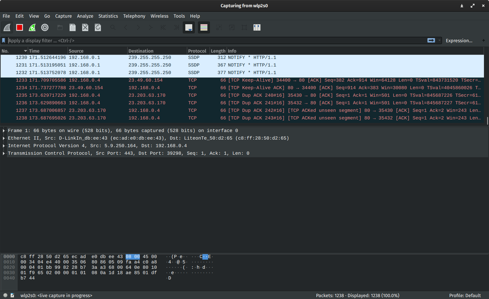

# The OSI model compendium

Table of contents:

- [What is the OSI model?](#what-is-the-osi-model)
- [Main terminology](#main-terminology)
- [OSI model layers](#osi-model-layers)
  - [Brief looks of layers](#brief-looks-of-layers)
  - [Detailed table](#detailed-table)
  - [Each layer in details](#each-layer-in-details)
    - [L7 the application layer](#l7-the-application-layer)
    - [L6 the presentation layer](#l6-the-presentation-layer)
    - [L5 the session layer](#l5-the-session-layer)
    - [L4 the transport layer](#l4-the-transport-layer)
    - [L3 the network layer](#l3-the-network-layer)
    - [L2 the data link layer](#l2-the-data-link-layer)
    - [L1 the physical layer](#l1-the-physical-layer)
  - [Transport layer ports](#transport-layer-ports)
  - [Important ports on transport layer](#important-ports-on-transport-layer)
  - [Acronyms](#acronyms)
- [TCP/IP model vs OSI model](#tcp/ip-vs-osi-model)
- [Credits](#credits)

## What is the OSI model?

**The Open Systems Interconnection (OSI) model** is a conceptual model created
by the International Organization for Standardization which enables diverse
communication systems to communicate using standard protocols. In plain English,
the OSI provides a standard for different computer systems to be able to
communicate with each other.

The OSI model can be seen as a universal language for computer networking. It’s
based on the concept of splitting up a communication system into seven abstract
layers, each one stacked upon the last.

Simply speaking this model helps you figure out on which level a problem
resides and very useful for troubleshooting network problems. Whether it’s one
person who can’t get their laptop on the Internet, or a web site being down
for thousands of users, the OSI model can help to break down the problem and
isolate the source of the trouble. If the problem can be narrowed down to one
specific layer of the model, a lot of unnecessary work can be avoided.

## Main terminology

**Encapsulation** is preparing & passing the data by any upper layer to the
Lower layer. That basically means, going from the application layer all the way
down to the physical layer.

**Decapsulation** is vice-versa encapsulation. This decoding data while going
Upwards from the physical layer until the application layer.

**L7-L5** are called Upper layers or Host layers. They usually work with an
application and not with the hardware itself.

**L4-L1** are called Lower layers or Media layers. They usually work with the
hardware.

When data unit is traversing (encapsulating) from **L7** to **L1** units wrap
by a header, puts on the top of a unit. So when it reaches to **L1** this will
look like this:  
**[Bits]** - **L1**  
**[Frame Header]** - **L2**  
**[Network header]** - **L3**  
**[Transport header]** - **L4**  
**[Data]** - **L7**-**L5**

The reverse happens when data units go from **L1** to **L7**. Layers strip
headers.

In order for human-readable information to be transferred over a network from
one device to another, the data must travel down the seven layers of the OSI
model on the sending device and then travel up the seven layers on the
receiving end.

For example: Mr. Cooper wants to send Ms. Palmer an email. Mr. Cooper composes
his message in an email application on his laptop and then hits ‘send’. His
email application will pass his email message over to the application layer,
which will pick a protocol (SMTP) and pass the data along to the presentation
layer. The presentation layer will then compress the data and then it will hit
the session layer, which will initialize the communication session.

The data will then hit the sender’s transportation layer where it will be
segmented, then those segments will be broken up into packets at the network
layer, which will be broken down even further into frames at the data link
layer. The data link layer will then deliver those frames to the physical
layer, which will convert the data into a bitstream of 1s and 0s and send it
through a physical medium, such as a cable.

Once Ms. Palmer’s computer receives the bit stream through a physical medium
(such as her wifi), the data will flow through the same series of layers on her
device, but in the opposite order. First the physical layer will convert the
bitstream from 1s and 0s into frames that get passed to the data link layer.
The data link layer will then reassemble the frames into packets for the
network layer. The network layer will then make segments out of the packets
for the transport layer, which will reassemble the segments into one piece
of data.

The data will then flow into the receiver's session layer, which will pass the
data along to the presentation layer and then end the communication session.
The presentation layer will then remove the compression and pass the raw data
up to the application layer. The application layer will then feed the
human-readable data along to Ms. Palmer’s email software, which will allow her
to read Mr. Cooper’s email on her laptop screen.

<strong>Figure:</strong> Wireshark example of headers.

## OSI model layers

### Brief looks of layers

<strong>Figure:</strong> the OSI layers and their usage.

### Detailed table

| Layer | OSI model layer | Protocol Data Unit | Devices                                    | Protocols                                                    |
| ----- | --------------- | ------------------ | ------------------------------------------ | ------------------------------------------------------------ |
| 7     | Application     | Data               | L7 firewall                                | HTTP, DNS, DHCP, FTP, Telnet, SSH, SMTP, POP, IMAP, NTP, SNMMP, TLS/SSL, GBP, RIP, SIP, etc. |
| 6     | Presentation    | Data               | L7 firewall                                | All the above                                                |
| 5     | Session         | Data               | L7 firewall                                | All the above                                                |
| 4     | Transport       | Segments           | L4 firewall                                | TCP (connection oriented), UDP (connectionless oriented)     |
| 3     | Network         | Packets            | Router, Multiplayer Switch, Router         | IPv4, IPv6, IPSec, OSPF, EIGRP                               |
| 2     | Data Link       | Frames             | Switch, Bridge, NIC, Wireless Access Point | MAC, ARP Ethernet 802.3 (Wired), CDP, LLDP, HDLC, PPP, DSL, L2TP, IEEE 802.11 (Wireless), SONET/SDH |
| 1     | Physical        | Bits               | All the above                              | Electrical signal (copper wire), Light signal (optical fibre), Radio signal (air) |

### Each layer in details

#### L7 the application layer

<strong>Figure:</strong> L7 the application layer

This is the only layer that directly interacts with data from the user.
Software applications like web browsers and email clients rely on the
application layer to initiate communications. But it should be made clear that
client software applications are not part of the application layer; rather the
application layer is responsible for the protocols and data manipulation that
the software relies on to present meaningful data to the user. Application
layer protocols include
[HTTP](https://www.cloudflare.com/learning/ddos/glossary/hypertext-transfer-protocol-http/),
HTTPS, FTP, SFTP, DNS as well as SMTP (Simple Mail Transfer Protocol is one of
the protocols that enables email communications), etc.

#### L6 the presentation layer

<strong>Figure:</strong> L6 the presentation layer.

This layer is primarily responsible for preparing data so that it can be used
by the application layer; in other words, layer 6 makes the data presentable
for applications to consume. The presentation layer is responsible for
translation,
[encryption](https://www.cloudflare.com/learning/ssl/what-is-encryption/), and
compression of data.

Two communicating devices communicating may be using different encoding
methods, so layer 6 is responsible for translating incoming data into a syntax
that the application layer of the receiving device can understand
(UTF8 -> ASCII or ASCII -> EBCDIC).

If the devices are communicating over an encrypted connection, layer 6 is
responsible for adding the encryption on the sender’s end as well as decoding
the encryption on the receiver's end so that it can present the application
layer with unencrypted, readable data (usually through SSL/TLS).

Finally, the presentation layer is also responsible for compressing data it
receives from the application layer before delivering it to layer 5. This
helps improve the speed and efficiency of communication by minimizing the
amount of data that will be transferred, moreover, data compression may be of
two types: lossy (data integrity isn't guaranteed) or lossless
(data integrity is guaranteed).

#### L5 the session layer

<strong>Figure:</strong> L5 the session layer.

This is the layer responsible for opening and closing communication between
the two devices. The time between when the communication is opened and closed
is known as the session. The session layer ensures that the session stays open
long enough to transfer all the data being exchanged, and then promptly closes
the session in order to avoid wasting resources.

The session layer also synchronizes data transfer with checkpoints.
For example, if a 100 megabyte file is being transferred, the session layer
could set a checkpoint every 5 megabytes. In the case of a disconnect or a
crash after 52 megabytes have been transferred, the session could be resumed
from the last checkpoint, meaning only 50 more megabytes of data need to be
transferred. Without the checkpoints, the entire transfer would have to begin
again from scratch.

Usually, the main tasks of L5 is authentication and authorisation, downloads
files as data packets, session management.

#### L4 the transport layer

<strong>Figure:</strong> L4 the transport layer.

This layer is separated by two protocols like Transport Control Protocol and
User Datagram Protocol. TCP is following connection-oriented transmission.
It's slower but provides feedback (HTTP, FTP, etc). UDP is following
connectionless transmission. It's faster but doesn't provide feedback and used
when we don't care about the fullness of data
(video games, music, movies, etc.).

Layer 4 is responsible for end-to-end communication between the two devices.
This includes taking data from the session layer and breaking it up into
chunks called segments (or datagrams in case of UDP) before sending it to
layer 3. The transport layer on the receiving device is responsible for
reassembling the segments into data the session layer can consume.

The transport layer is also responsible for flow control and error control,.
Flow control determines an optimal speed of transmission to ensure that a
sender with a fast connection doesn’t overwhelm a receiver with a slow
connection. The transport layer performs error control on the receiving end by
ensuring that the data received is complete , and checks checksums of data
units and make use of automatic repeat request if it isn’t.

#### L3 the network layer

<strong>Figure:</strong> L3 the network layer.

The network layer is responsible for facilitating data transfer between two
different networks. If the two devices communicating are on the same network,
then the network layer is unnecessary. The network layer breaks up segments
from the transport layer into smaller units, called packets, on the sender’s
device, and reassembling these packets on the receiving device. The network
layer also finds the best physical path for the data to reach its destination;
this is known as routing.

Main duties of this layer usually are logical addressing
(IPv4, IPv6, mask, IP), routing (to whom send packets), Path determination
(Open Shortest Path First, Border Gateway Protocol, intermediate
system-intermediate system).

#### L2 the data link layer

<strong>Figure:</strong> L2 the data link layer.

The data link layer is very similar to the network layer, except the data link
layer facilitates data transfer between two devices on the SAME network.
The data link layer takes packets from the network layer and breaks them into
smaller pieces called frames. Like the network layer, the data link layer is
also responsible for flow control and error control in intra-network
communication (The transport layer only does flow control and error control
for inter-network communications).

Duties usually are logical addressing (network layer), physical addressing
(data link layer via MAC addresses of Network Interface Card, Switches),
access media, controls how data is placed and received from the media
(media access control, error detection).

#### L1 the physical layer

<strong>Figure:</strong> L1 the physical layer.

This layer includes the physical equipment involved in the data transfer,
such as the cables and switches. This is also the layer where the data gets
converted into a bit stream, which is a string of 1s and 0s. The physical layer
of both devices must also agree on a signal convention so that the 1s can be
distinguished from the 0s on both devices.

### Transport layer ports

| Category         | Range       | Comments                                                     |
| ---------------- | ----------- | ------------------------------------------------------------ |
| Well Known Ports | 0 - 1023    | Used by system processes e.g. SSH(22), DNS(53), FTP(21), etc. |
| Registered Ports | 1024-49151  | For specific services e.g. PostgreSQL(5432), Redis(6379), etc. |
| Private Ports    | 49152-65535 | For private purposes e.g. to run an application              |

### Important ports on transport layer

| Port Number | Protocol | Application                     |
| ----------- | -------- | ------------------------------- |
| 20          | TCP      | FTP data                        |
| 21          | TCP      | FTP control                     |
| 22          | TCP      | SSH                             |
| 23          | TCP      | Telnet                          |
| 25          | TCP      | SMTP                            |
| 53          | UDP, TCP | DNS                             |
| 67, 68      | UDP      | DHCP                            |
| 69          | UDP      | TFTP                            |
| 80          | TCP      | HTTP                            |
| 110         | TCP      | POP3                            |
| 161         | UDP      | SNMP                            |
| 443         | TCP      | SSL                             |
| 16384-32767 | UDP      | TRP-base Voice (VoIP) and Video |

### Acronyms

These acronyms are useful to remember the OSI model.

All People Seem To Need Data Processing (**L7**-**L1**).  
Please Do Not Throw Sausage Pizza Away (**L1**-**L7**).

## TCP/IP model vs OSI model

**TCP/IP Model** helps you to determine how a specific computer should be
connected to the internet and how data should be transmitted between them. It
helps you to create a virtual network when multiple computer networks are
connected together. The purpose of TCP/IP model is to allow communication over
large distances.

TCP/IP stands for Transmission Control Protocol/ Internet Protocol. It is
specifically designed as a model to offer highly reliable and end-to-end byte
stream over an unreliable internetwork.

| OSI Layer | OSI          | TCP/IP Layer | TCP/IP         | Protocol Data Unit |
| --------- | ------------ | ------------ | -------------- | ------------------ |
| 7         | Application  | 4            | Application    | Data               |
| 6         | Presentation | 4            | Application    | Data               |
| 5         | Session      | 4            | Application    | Data               |
| 4         | Transport    | 3            | Transport      | Segments           |
| 3         | Network      | 2            | Internet       | Packets            |
| 2         | Data Link    | 1            | Network Access | Frames             |
| 1         | Physical     | 1            | Network Access | Bits               |

## Credits

- [What is the OSI model?](https://www.cloudflare.com/learning/ddos/glossary/open-systems-interconnection-model-osi/)
- [Network Fundamentals](https://drive.google.com/file/d/1i1KT_mE-pfsasubSGWZST91XLDGwEfMU/view)
- [OSI Model – Cheatsheet (ATech)](http://aurumme.com/atech/wp-content/uploads/2018/04/OSI-Model-CheatSheet-ATech-Waqas-Karim.pdf)
- [OSI Model Explained](https://youtu.be/vv4y_uOneC0)
- [TCP/IP Model: What is TCP IP Stack? Protocol Layers, Advantages](https://www.guru99.com/tcp-ip-model.html)
